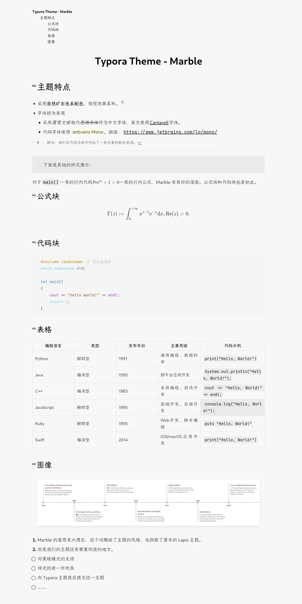

<a href="README.en.md">English</a> / 简体中文

<h1 align="center">Typora Theme - Marble</h1>

一款简约柔和的 Typora 主题

## 简介

我一直很喜欢 Typora 的[Lapis主题](https://github.com/YiNNx/typora-theme-lapis)，最近闲来无事时打开 Lapis 的 CSS 文件，把字体改成了我最喜欢的霞鹜文楷。突然想到，既然要改，那为什么不改得彻底一点？

于是，鼓捣了一晚上之后，就有了这个主题。

我本身不会 CSS （是的你没听错，我完全不会 CSS），主题 CSS 文件基本上是对 Lapis 的魔改。而我本身很喜欢比较自然的配色，因此参考 Lapis（天青石），将这个主题命名为 Marble（大理石）。

## 预览

这里是一份预览图片。

    

## 特点

### 字体与配色

Marble 主题支持英文和简体中文，正文字体中文使用[霞鹜文楷](https://github.com/lxgw/LxgwWenKai)，英文使用[Cantarell](https://fonts.google.com/specimen/Cantarell)。

Marble 主题采用自然柔和的主题配色。背景颜色为大理石色，文字颜色为深灰色，块元素的背景颜色为略深于背景的灰色。

### 代码块

代码字体使用 [Jetbrains Mono](https://www.jetbrains.com/lp/mono/)。代码块配色主要基于 Lapis 主题，使用了一些矿石的颜色进行修改，例如玫瑰石膏、青金石、蓝宝石、白垩石、黄铁矿和绿松石等。由于我并不熟悉前端开发加之审美水平有限，可能不是很好看，欢迎大家提出修改意见。

## 安装

目前主题在 [Github](https://github.com/yoghurtlee-thu/typora-theme-marble) ， [Gitee](https://gitee.com/yoghurtlee-thu/typora-theme-marble) 和 [Codeburg](https://codeberg.org/chlorine3545/typora-theme-marble) 均有开源，大家可以自行选择下载源。

1. Clone 此仓库，或从 Latest Release 中下载 `typora-theme-marble.zip`并解压。
2. 打开 Typora 菜单的主题部分，点击“打开主题文件夹”按钮。
3. 将 `marble.css` 文件和 `marble` 文件夹复制到 Typora 的主题文件夹中。
4. 重启 Typora，然后从主题列表中选择 **Marble** 即可。

## To-Do List

- [ ] 黑暗模式支持
- [ ] 优化主题配色，更加真实地做出矿石的感觉
- [ ] 优化代码配色
- [ ] 参考其他优秀主题进行样式改良
- [ ] 将主题提交至 Typora 主题商店
- [ ] ……

## 贡献

本主题最初仅供个人使用，主题样式基于作者个人的喜好进行调整；同时本主题的最初开发基于 Windows 11 23H2 系统，后续维护基于 macOS Sonoma 系统，在其他系统上可能存在未知的样式问题。

由于作者暂时没有主题维护能力，因此对于出现的问题仅能保证尽力修复。若有社区大佬愿意出手相助，不胜感激（合十）。

欢迎您在 Github/Gitee/Codeburg 提出 Issue/Pull Request。您也可以通过邮件 [yoghurtlee123@gmail.com](mailto:yoghurtlee123@gmail.com) 联系我，感谢您宝贵的意见和建议。

## 致谢

- 样式代码基于 [YiNNx](https://github.com/YiNNx) 的 [Lapis主题](https://github.com/YiNNx/typora-theme-lapis) 。
- 中文字体采用好看的开源字体[霞鹜文楷 LXGW](https://github.com/lxgw/LxgwWenKai)。
- 感谢 ChatGPT 和 Github Copilot 的鼎力相助（逃

## 许可

Marble 主题在 MIT License 下开源。[这里](https://github.com/YiNNx/typora-theme-lapis/blob/main/License) 是原主题 Lapis 的 MIT License 地址。
